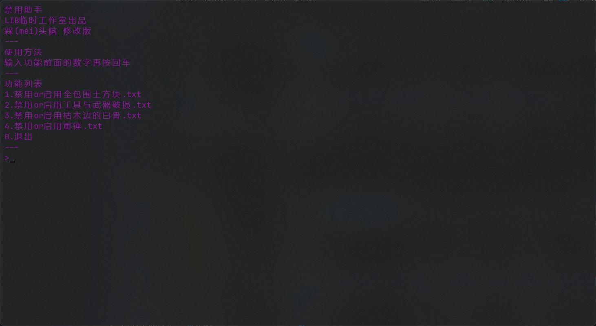

# README

该脚本用于**自动修改 Minecraft 材质包**。

在使用多个材质包时，时常会遇到“想要 A 材质包的部份效果，同时也想要 B 材质包的另一个效果，可同时使用时，无论将哪个的优先级提高，都会将另一个材质包的效果覆盖”等之类的情况。

这时候我们可以通过**修改材质包**来解决。可每当材质包更新时，我们都要**重新更改一次**。这太麻烦了，于是我就写了这个**自动修改**的 bat 脚本。

因为是 bat 脚本，所以**只能在 Win 端使用**。只需要在 txt 文件里加上需要修改的文件路径，就可以方便的自定义功能。该操作**不需要代码知识**，只要**会一点点材质包的修改方法**就行。具体使用方法在 `delHelperREADME.txt` 文件里，这里只是对脚本的简要介绍。

材质包作者也可以将该脚本直接内置到材质包内，这样就可以省去维护“附加包”、“附减包”之类的麻烦了。

该脚本最开始由“梧桐材质”群中的群友——指令小蛇写出，由我进行修改（其实内里几乎全改了，已经是我的形状了，桀桀桀桀 #手动狗头）。

***注意！！！本脚本不需要懂代码，但至少要会一点点材质包的修改方法！***